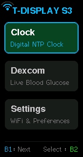
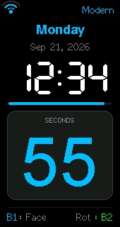
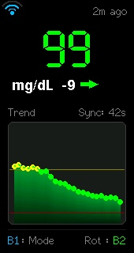
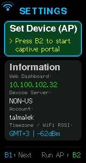
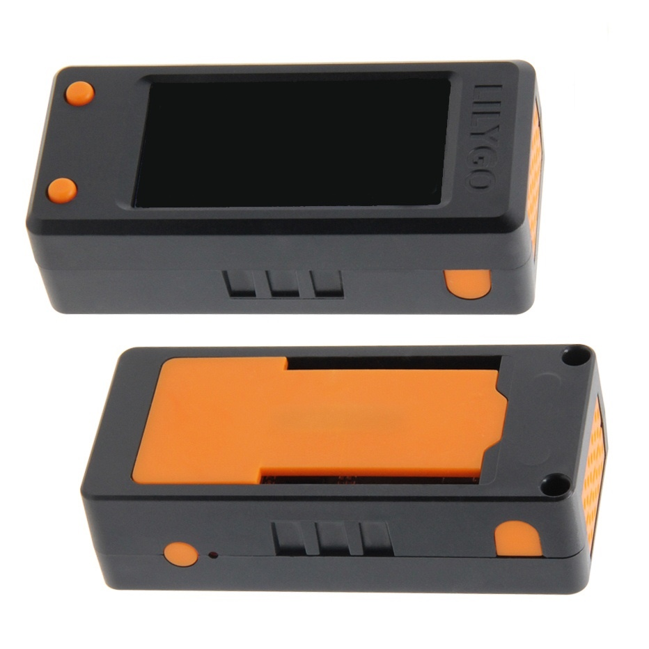
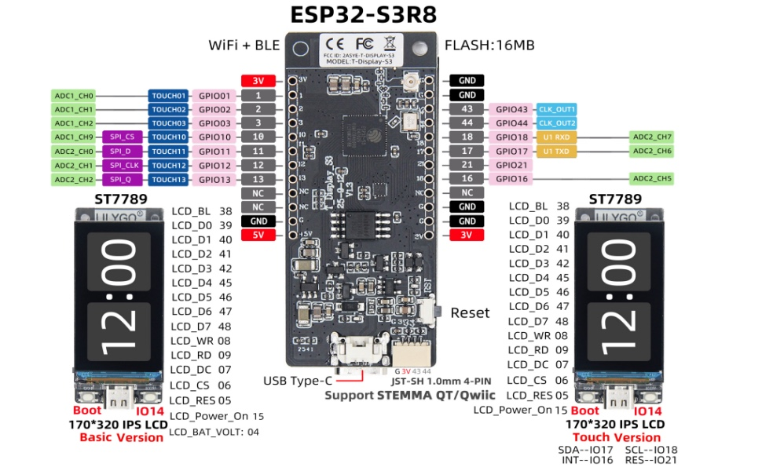

# 📟 LilyGO T-Display-S3 Multi-App OS

<p align="center">
  
  
  
  
</p>

<p align="center">
  A modular multi-app operating system firmware for the <b>LilyGO T-Display-S3</b> (1.9" ST7789 170x320 IPS LCD, 16MB Flash, 8MB PSRAM).<br/>
  Features double-buffered PSRAM rendering, multi-orientation display support, multiple watch faces, live Dexcom CGM tracking with vector trend arrows, an onboard captive setup portal, and an embedded web dashboard with real-time screen mirroring.
</p>

<p align="center">
  <a href="#-quick-navigation"><b>Quick Navigation</b></a> &bull;
  <a href="#-device-screenshots-live-hardware-capture"><b>Screenshots</b></a> &bull;
  <a href="#-key-features"><b>Features</b></a> &bull;
  <a href="#-hardware-controls"><b>Controls</b></a> &bull;
  <a href="#-pinout--hardware-specifications"><b>Pinout</b></a> &bull;
  <a href="#-build--flash"><b>Build & Flash</b></a>
</p>

---

## 🧭 Quick Navigation

| Section | Description |
| :--- | :--- |
| [📱 **Device Screenshots**](#-device-screenshots-live-hardware-capture) | Pixel-perfect hardware captures of all primary application screens |
| [🚀 **App Launcher**](#1-app-launcher) | Interactive main menu, PSRAM double-buffering, and status header |
| [⏰ **Clock Application**](#2-clock-app-multiple-watch-faces--orientation) | 3 dynamic watch faces, SNTP network sync, and multi-orientation layouts |
| [🩸 **Dexcom CGM App**](#3-dexcom-cgm-app-3-view-modes-orientation--vector-trends) | Live blood glucose monitoring, vector trend arrows, and gradient history curve |
| [⚙️ **Settings & Wi-Fi AP**](#4-settings--wi-fi-setup-ap-mode) | Onboard captive portal setup, network status, and live RSSI diagnostic |
| [🌐 **Web Dashboard & Mirror**](#5-embedded-web-dashboard--live-screen-mirror) | Browser-based remote control, interactive SVG chart, and live screen mirror |
| [🎮 **Hardware Controls**](#-hardware-controls) | Button mappings and chord exit shortcuts across all states |
| [🔌 **Hardware Pinout**](#-pinout--hardware-specifications) | ST7789 8-bit parallel bus, backlight PWM, and power pin table |
| [🛠️ **Build & Flash Guide**](#-build--flash) | PlatformIO compilation, flashing commands, and firmware backup/restore |

---

## 📱 Device Screenshots (Live Hardware Capture)

<table align="center" width="100%">
  <thead>
    <tr align="center">
      <th width="25%"><b>🚀 App Launcher</b></th>
      <th width="25%"><b>⏰ Clock (Modern Face)</b></th>
      <th width="25%"><b>🩸 Dexcom CGM (Live)</b></th>
      <th width="25%"><b>⚙️ Settings & Info</b></th>
    </tr>
  </thead>
  <tbody align="center">
    <tr>
      <td><a href="#1-app-launcher"></a></td>
      <td><a href="#2-clock-app-multiple-watch-faces--orientation"></a></td>
      <td><a href="#3-dexcom-cgm-app-3-view-modes-orientation--vector-trends"></a></td>
      <td><a href="#4-settings--wi-fi-setup-ap-mode"></a></td>
    </tr>
    <tr>
      <td><em>Vertical card navigation with live Wi-Fi status</em></td>
      <td><em>Digital readout, 60s progress bar & seconds card</em></td>
      <td><em>Live 99 mg/dL reading, trend arrow & gradient history</em></td>
      <td><em>Captive AP launcher & device diagnostics</em></td>
    </tr>
  </tbody>
</table>

---

## ⚡ Key Features

### 1. App Launcher


- Fast interactive vertical menu formatted for the 170x320 IPS display.
- Double-buffered, flicker-free rendering via PSRAM sprites (`TFT_eSprite`).
- Direct navigation with hardware buttons and dual-button chord exit.
- Live Wi-Fi signal strength fan icon in status bar.
<br clear="right"/>

### 2. Clock App (Multiple Watch Faces & Orientation)


- **Automatic SNTP Sync**: Synchronizes with network time servers (`pool.ntp.org`, `time.google.com`).
- **Live Status Header**: Graphical Wi-Fi fan icon displaying real-time RSSI signal strength and watch face badge.
- **3 Dynamic Watch Faces** (Toggle with **Button 1**):
  1. **Modern Digital**: Clean 7-segment digital time, weekday and date, live 60-second progress bar, and large bottom seconds readout.
  2. **Bold Digital**: Massive stacked Hour & Minute numbers, date chip, and giant yellow seconds card.
  3. **Minimal Clean**: Orbital second ring dial with moving second hand indicator and clean typography.
- **Orientation Toggle** (Toggle with **Button 2**):
  - **Vertical Mode** (170x320): Vertical stacked layout with bottom seconds card and status badges.
  - **Horizontal / Landscape Mode** (320x170): Split-screen with time/date on the left and a large seconds card on the right.
<br clear="right"/>

### 3. Dexcom CGM App (3 View Modes, Orientation & Vector Trends)


- **Direct Dexcom Share API Integration**: Connects securely with both US (`share1.dexcom.com`) and International (`shareous1.dexcom.com`) servers.
- **Dynamic Graphical Wi-Fi Signal Strength Fan Icon**:
  - Live RSSI-based 3-arc icon across all screens: Green (Strong > -60 dBm), Cyan (Medium -75 to -60 dBm), Yellow (Weak < -75 dBm), and Red Disconnected indicator.
- **Precision Vector Trend Arrows**: High-resolution vector glyphs for all 7 Dexcom trend directions:
  - Double Up (`^^`), Single Up (`^`), Forty-Five Up (`/^`), Flat (`->`), Forty-Five Down (`\v`), Single Down (`v`), and Double Down (`vv`).
- **Configurable Target Thresholds**: User-defined Target Low (default 70 mg/dL) and Target High (default 180 mg/dL) with dynamic color coding (Green: In-Range, Yellow: High, Red: Low/Urgent).
- **3 View Modes** (Cycle with **Button 1**):
  1. **Value + Graph**: Digital Font 7 glucose reading, delta value (`+/-`), vector trend arrow, elapsed age ("Xs ago"), and trend history graph with target boundaries.
  2. **Value Full-Screen**: Extra-large Font 8 glucose reading with centered delta pill badge, vector trend arrow, and elapsed time.
  3. **Graph Full-Screen**: Full-screen continuous glucose history curve with dynamically measured, boundary-safe summary banner and min/max reference lines.
- **Orientation Toggle** (Toggle with **Button 2**):
  - Seamlessly switch between Vertical (170x320) and Landscape (320x170) widescreen modes without header or status overlaps.
- **Decoupled Background Polling**: FreeRTOS background task with automatic 60-second polling and live on-screen sync countdown.
<br clear="right"/>

### 4. Settings & Wi-Fi Setup AP Mode


- **Clean Settings Interface**:
  - **Set Device (AP)**: One-click launch of the onboard captive configuration portal.
  - **Information Card**: Displays live IP address, Dexcom server, active account, timezone offset (`GMT±X`), and Wi-Fi RSSI signal strength.
  - **Header**: Live Wi-Fi signal strength fan icon.
- **Dedicated AP Setup Screen**:
  - Clear, centered instructions indicating AP Mode.
  - Explicit connection details (`T-Display AP` SSID and `192.168.4.1` web setup address).
<br clear="right"/>

### 5. Embedded Web Dashboard & Live Screen Mirror
- Built-in asynchronous HTTP server accessible from any browser on your local network (e.g. `http://<device-ip>/`).
- **Live Physical Screen Mirror**:
  - Automatically mirrors the physical ST7789 display buffer in real time directly inside the browser interface.
  - Snapshot button and one-click BMP/JPG screenshot download (`/api/screenshot`).
- **Live Remote Screen Control**:
  - Remotely switch screens between **Launcher**, **Clock**, **Dexcom CGM**, and **Settings**.
  - Cycle watch faces, toggle CGM view modes, and rotate orientations on the fly.
  - Real-time display backlight brightness slider (20–255).
- **Interactive SVG CGM Graph**:
  - Real-time vector glucose history visualization rendered directly in the browser with target low/high boundary lines.
- **Settings & Preferences Configuration**:
  - Update Dexcom account credentials and server region (US vs Non-US).
  - Target glucose limits (Low and High thresholds).
  - Timezone offset selector (`-12` to `+12` UTC) with instantaneous SNTP re-sync.
  - 12h / 24h clock format toggle.

## 🎮 Hardware Controls & Enclosure

<p align="center">
  
</p>

| Control | In Launcher | In Clock App | In Dexcom CGM App | In Settings Screen |
| :--- | :--- | :--- | :--- | :--- |
| **Button 1 (BOOT / GPIO 0)** | Cycle next app | Cycle Watch Face | Cycle CGM View Mode | Cycle menu items |
| **Button 2 (KEY1 / GPIO 14)** | Select / Enter app | Rotate Orientation | Rotate Orientation | Enter AP / View Info |
| **Chord (B1 + B2 together)** | — | **Exit to Launcher** | **Exit to Launcher** | **Exit to Launcher** |

---

## 🔌 Hardware Specifications & Pinout Diagram

<p align="center">
  
</p>

| Function | Pin / GPIO | Description |
| :--- | :--- | :--- |
| **LCD Power Enable** | `GPIO 15` | Must be set HIGH to power the ST7789 |
| **LCD Backlight** | `GPIO 38` | PWM / Digital brightness control |
| **ST7789 8-bit Parallel** | `D0..D7`: `39, 40, 41, 42, 45, 46, 47, 48` | High-speed 8-bit parallel bus |
| **Display Control Pins** | `CS: 6`, `DC: 7`, `WR: 8`, `RD: 9`, `RST: 5` | Hardware bus signals |
| **Button 1 (BOOT)** | `GPIO 0` | Input pull-up button |
| **Button 2 (KEY1)** | `GPIO 14` | Input pull-up button |
| **Battery ADC** | `GPIO 4` | Battery voltage monitor |

---

## Build & Flash

Built using [PlatformIO](https://platformio.org):

```bash
# Build firmware
pio run -e t-display-s3

# Flash to device via USB CDC
pio run -e t-display-s3 -t upload --upload-port /dev/cu.usbmodem2101

# Monitor serial output (115200 baud)
pio device monitor -b 115200
```

---

## Firmware Backup & Restore

A clean standalone restore point of this release is packaged in `backup/firmware_backup_clean.bin` (contains bootloader, partition table, and full application binary, zero personal credentials or Wi-Fi data):

```bash
# Restore firmware at any time:
./restore_firmware.sh backup/firmware_backup_clean.bin

# Or create a full flash backup of your current device state:
./backup_firmware.sh
```
